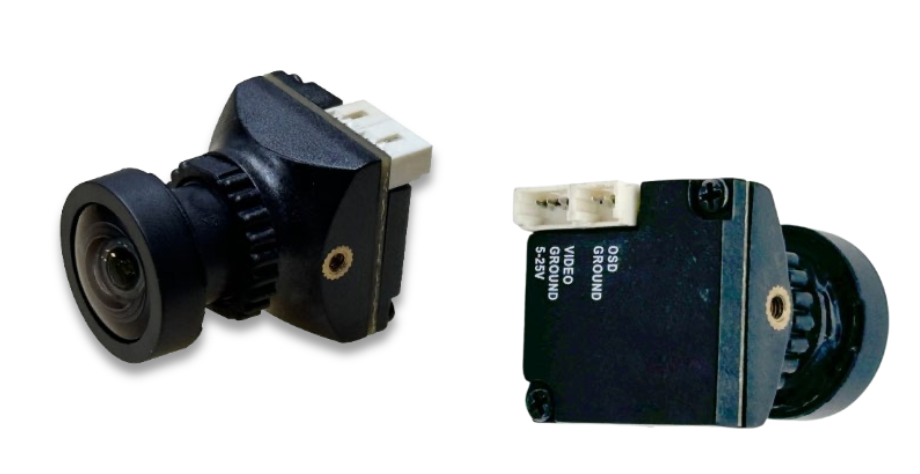
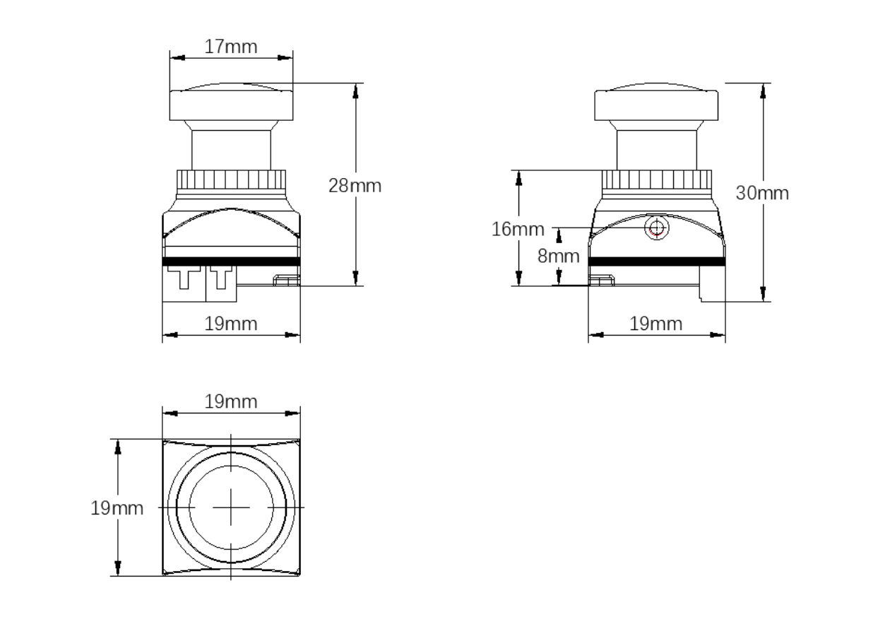

# Specifications

The **IronSight Analog Camera** is a high-performance FPV imaging module designed for professional unmanned systems, ISR platforms, and low-latency analog video applications.

---

## 📷 Camera & Imaging

| Specification | Details |
|---------------|---------|
| Image Sensor | Sony 1/2.8" IMX662 CMOS |
| Image Processor | WDR Image Processor |
| Resolution | 2000 TVL (1920 × 1080 equivalent) |
| Video Standard | NTSC 30 fps / PAL 25 fps |
| Scan Mode | Progressive Scan |
| Minimum Illumination | 0.001 Lux |
| Shutter (PAL) | 1/25 – 1/10,000 sec |
| Shutter (NTSC) | 1/30 – 1/10,000 sec |
| Wide Dynamic Range | 120 dB |
| Display Aspect Ratio | 4:3 / 16:9 (adjustable) |

---

## 🔍 Lens & Optics

| Specification | Details |
|---------------|---------|
| Lens Type | Fixed Lens |
| Focal Length | 2.1 mm |
| Infrared Filter | 650 nm (Non-inductive infrared) |
| Field of View (Horizontal) | 80° |
| Field of View (Diagonal) | 120° |

---

## 🖼 Image Processing Features

| Feature | Support |
|-------|---------|
| Automatic Gain Control (AGC) | Supported |
| Day / Night Modes | External / Auto / Color / B&W |
| Wide Dynamic Range (WDR) | Supported |
| Digital Noise Reduction | 3D DNR |
| White Balance | Automatic (AWB) |
| OSD Menu | Supported |
| Menu Languages | Chinese, English, others |

---

## 🔌 Interface & Electrical

| Specification | Details |
|---------------|---------|
| Video Output | CVBS (Analog) |
| Power Supply | DC 5 – 25 V |

---

## 🌡 Environmental & Physical

| Specification | Details |
|---------------|---------|
| Operating Temperature | −20 °C to +60 °C |
| Operating Humidity | 20 – 80% RH (90% RH max) |
| Housing Material | Plastic |
| Dimensions | 19 × 19 mm |
| Weight | 8.5 g |

---

## 📦 Package Contents

| Item | Description |
|-----|-------------|
| Camera Module | IronSight Analog Camera |
| OSD Control Board | Button-based configuration board |
| Wiring Harness | Power / video / OSD cable |
| Packaging | Protective foam insert |

---

## ⚠️ Integration Notes

- Designed for **low-latency analog video transmission**.
- Compatible with standard analog VTX systems including EwingVTX.
- OSD menu access requires included control board.
- Ensure stable power supply within specified voltage range.

---

*Specifications subject to change as part of ongoing product improvement and validation.*

© Ewing Aerospace. All rights reserved.
