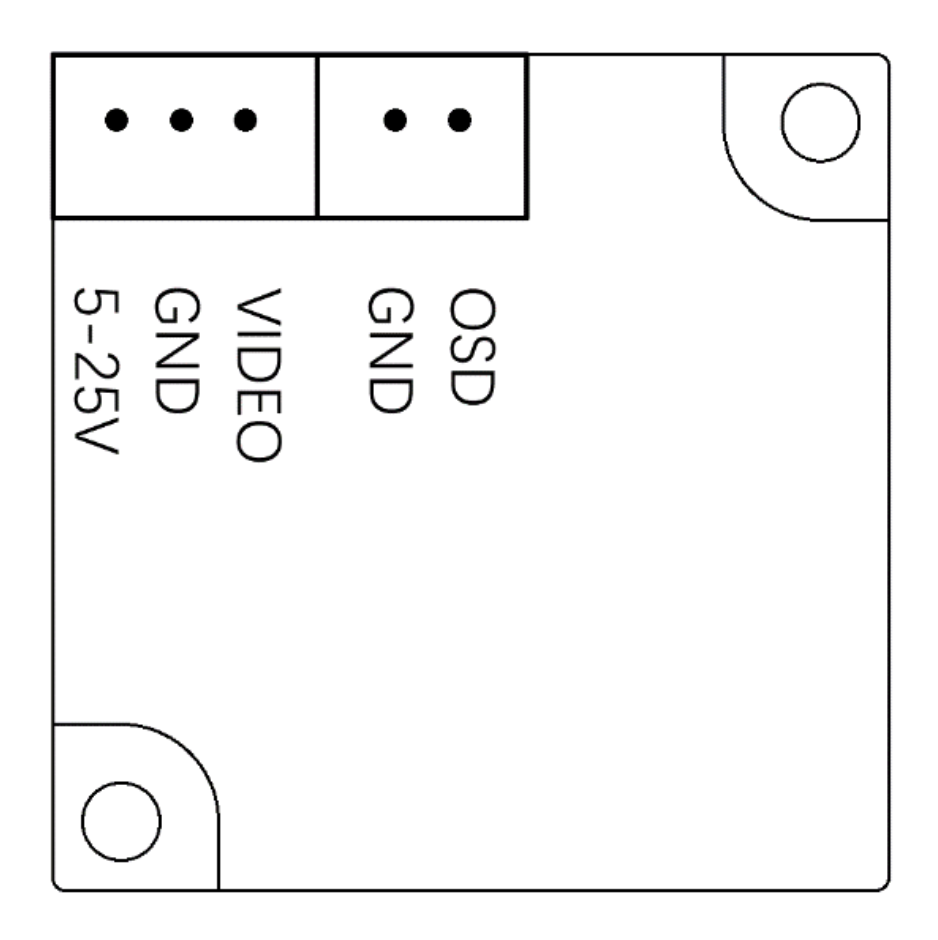

## IronSight Analog Camera – Wiring & Pinout

This document describes the electrical connections for the **Ewing Aerospace IronSight Analog Camera**. Proper wiring is required for correct operation, video output, and OSD menu access.

---

## Pinout Overview

The IronSight camera provides two connectors:
- **Main Camera Connector** (Power + Video)
- **OSD Control Connector** (Menu control)

---

## Main Camera Connector (Power & Video)

| Pin | Signal | Description |
|----|--------|------------|
| 1 | **5–25V** | Power input (DC 5 V to 25 V) |
| 2 | **GND** | Ground |
| 3 | **VIDEO** | Composite video output (CVBS) |

### Notes
- The camera supports a **wide input voltage range** and may be powered directly from regulated or unregulated system rails within specification.
- Use a **clean power source** to minimize video noise.
- The VIDEO signal should be routed directly to an analog VTX (such as EwingVTX) or DVR input.

---

## OSD Control Connector

| Pin | Signal | Description |
|----|--------|------------|
| 1 | **GND** | Ground |
| 2 | **OSD** | OSD menu control signal |

### Notes
- The OSD pin connects to the **included button-based OSD control board**.
- This interface allows access to camera configuration menus such as WDR, DNR, aspect ratio, and day/night modes.
- The OSD control board is not required for normal operation once settings are configured.

---

## Typical Wiring Example

| Camera Signal | Connects To |
|--------------|-------------|
| 5–25V | System power rail |
| GND | Common ground |
| VIDEO | VTX video input |
| OSD | OSD control board |

---

## Integration Notes

- Always connect **ground first**, then power.
- Do **not hot-plug** the camera while powered at high voltage.
- Ensure the VTX and camera share a **common ground reference**.
- Secure wiring to prevent vibration-induced failures in flight applications.

---

## Safety Notice

Improper wiring or exceeding voltage limits may result in permanent damage to the camera or connected equipment. Verify polarity and voltage before applying power.

---

© Ewing Aerospace. All rights reserved.
